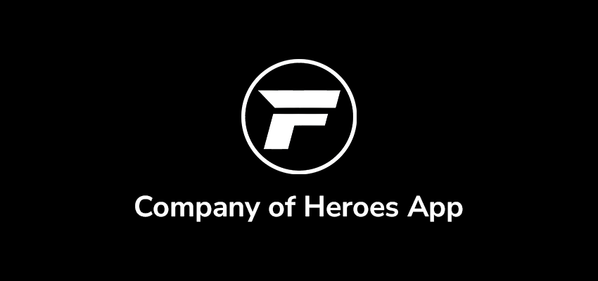
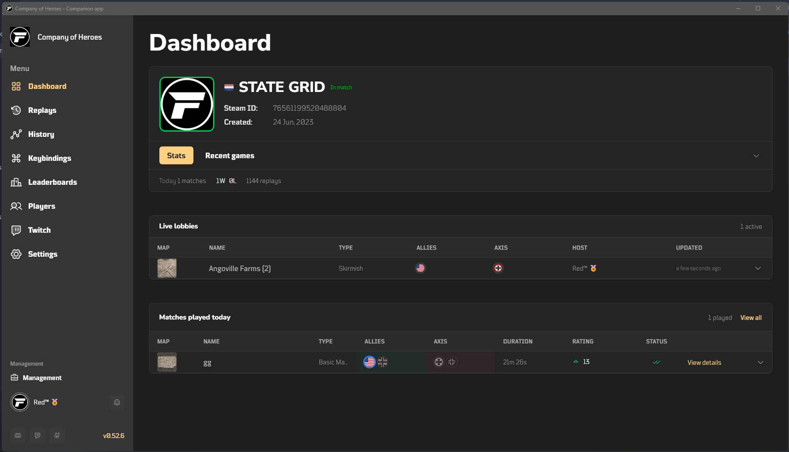
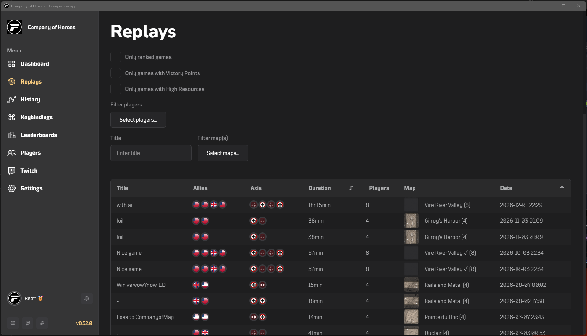
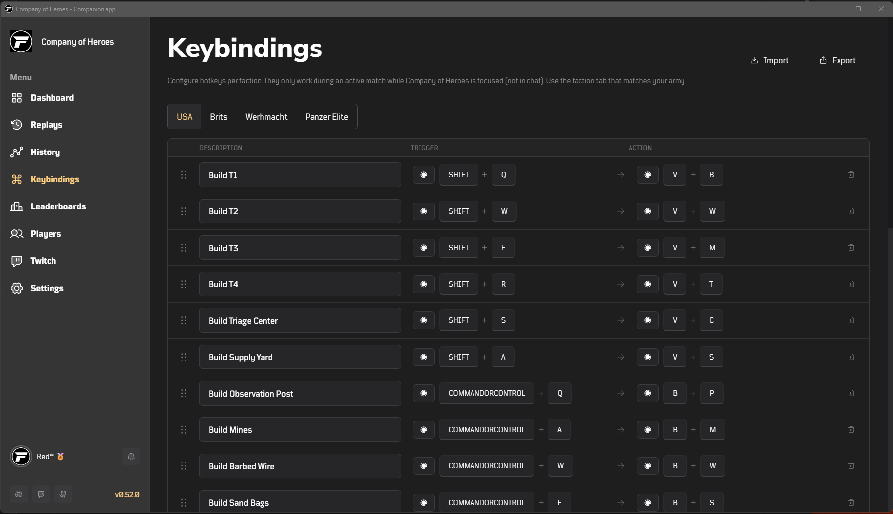
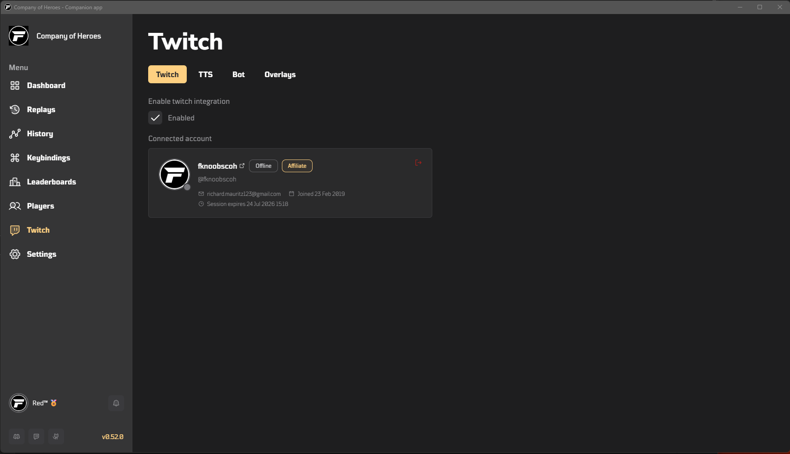

**Company of Heroes - Companion** is a free desktop app for **Company of Heroes**. It runs alongside the game and adds replay analysis, match history, player lookup, leaderboards, custom keybindings, and Twitch streaming tools — all in one place.

Built with **Tauri**, **SvelteKit**, and **PocketBase**.

> [!WARNING]
> **Work in progress:** the app is actively developed. Expect changes, incomplete features, and the occasional bug.

## Download & install

**Latest release:** https://github.com/fknoobs/app/releases/latest

Grab the **Windows installer** — the `.exe` named like `fknoobscoh_<version>_x64-setup.exe`.  
Skip “Source code (zip/tar.gz)” unless you want to build it yourself.

### Step-by-step

1. **Download** the installer from the [latest release](https://github.com/fknoobs/app/releases/latest) page
2. If your **browser** warns you (“This file may not be safe”) → click **Keep** / **Download anyway**
3. **Run** the `.exe` you just downloaded
4. If **Windows SmartScreen** blocks it (“Windows protected your PC” / “Unknown publisher”) → click **More info** → **Run anyway**
5. Follow the installer — pick your shortcut, finish setup
6. Launch **Company of Heroes - Companion** from the Start Menu or desktop shortcut

> [!IMPORTANT]
> **Why the warnings?** The app is **not code-signed** yet. Signing certificates are expensive, and this is a free hobby project — so Windows and your browser don’t recognize the publisher. That’s normal for unsigned apps.
>
> As long as you downloaded from the official GitHub releases link above, it’s safe to proceed with **More info → Run anyway**.
>
> **Microsoft Store from v1.0:** From version 1.0 onwards, **Company of Heroes - Companion** will be published on the Microsoft Store — no more browser or SmartScreen warnings. Until then, grab pre-1.0 builds from GitHub releases above.

## Features

Everything you need between games — no alt-tab chaos.

<table>
  <tr>
    <td width="50%" valign="top">

**Dashboard**  
Your command center. Live lobbies, recent matches, and quick links into every part of the app.

</td>
    <td width="50%" valign="top">

**Replays**  
Point it at your replay folder and go. Browse, filter, and open any match for details, chat logs, and analysis.

</td>
  </tr>
  <tr>
    <td width="50%" valign="top">

**Match history**  
Your games and the community’s — searchable, filterable, and one click away from full match breakdowns.

</td>
    <td width="50%" valign="top">

**Keybindings**  
Custom shortcuts per faction — USA, Brits, Wehrmacht, Panzer Elite. Record, drag to reorder, export & import.

</td>
  </tr>
  <tr>
    <td width="50%" valign="top">

**Leaderboards**  
Relic leaderboards by mode and faction. Search players, see the podium, climb the ranks.

</td>
    <td width="50%" valign="top">

**Players**  
Look anyone up by name, Steam ID, or Relic profile. Profiles with match history and stats included.

</td>
  </tr>
  <tr>
    <td width="50%" valign="top">

**Live game**  
Lobby started? The app notices. Jump into a live match view and save it to your history when the game ends.

</td>
    <td width="50%" valign="top">

**Twitch**  
Connect your channel and stream with purpose:
- **TTS** — chat read aloud (ElevenLabs, StreamElements, …)
- **Bot** — commands and moderation helpers
- **Overlays** — OBS-ready Opponent Bot overlay hosted on api.coh1stats.com

</td>
  </tr>
</table>

Auto-updates with changelog · Account sync · Discord, Twitch & GitHub in the sidebar

## Screenshots

<table>
  <tr>
    <td width="50%" align="center">

**Dashboard**  


</td>
    <td width="50%" align="center">

**Replays**  


</td>
  </tr>
  <tr>
    <td width="50%" align="center">

**Match history**  


</td>
    <td width="50%" align="center">

**Keybindings**  


</td>
  </tr>
  <tr>
    <td width="50%" align="center">

**Leaderboards**  


</td>
    <td width="50%" align="center">

**Players**  


</td>
  </tr>
  <tr>
    <td colspan="2" align="center">

**Twitch**  


</td>
  </tr>
</table>

---

## Development

This is a **pnpm monorepo**. The desktop app lives in `packages/app`; the local PocketBase stack lives in `packages/pocketbase`.

### Prerequisites

- [Node.js](https://nodejs.org/) 20+
- [pnpm](https://pnpm.io/) 9+
- [Rust](https://www.rust-lang.org/tools/install) (for Tauri)
- [Docker](https://www.docker.com/) (for local PocketBase)

### Run locally

From the repo root:

```bash
pnpm install
pnpm dev
```

This starts PocketBase on `http://localhost:8090` and launches the Tauri dev window. PocketBase data is stored in `packages/pocketbase/pb_data`.

### Environment

Copy `packages/app/.env.example` to `packages/app/.env` and set:

```env
PUBLIC_PB_URL=http://localhost:8090
```

When `PUBLIC_PB_URL` is not set, the app falls back to the production API at `https://api.coh1stats.com`.

### PocketBase commands

```bash
pnpm pb:up              # start PocketBase (Docker)
pnpm pb:down            # stop PocketBase
pnpm pocketbase:typegen # regenerate TypeScript types after schema changes
```

Optionally create an admin user at `http://localhost:8090/_/`.

### Build

```bash
pnpm build              # production Tauri build (Windows)
```

Platform-specific builds are also available under `packages/app`:

```bash
pnpm --filter app tauri:build:windows
pnpm --filter app tauri:build:macos
pnpm --filter app tauri:build:linux
```

### Notes

- `packages/pocketbase/pb_data` is gitignored.
- OppBot overlay is developed separately: `pnpm overlays:dev` / `pnpm overlays:build` (in `packages/oppbot-overlay`).

---

### Maintained by

Richard Mauritz — [richard@codeit.ninja](mailto:richard@codeit.ninja)
