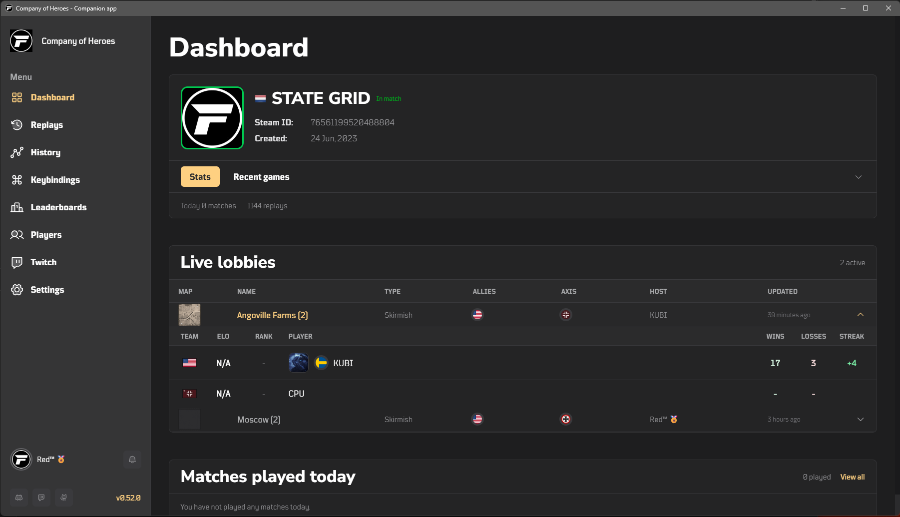
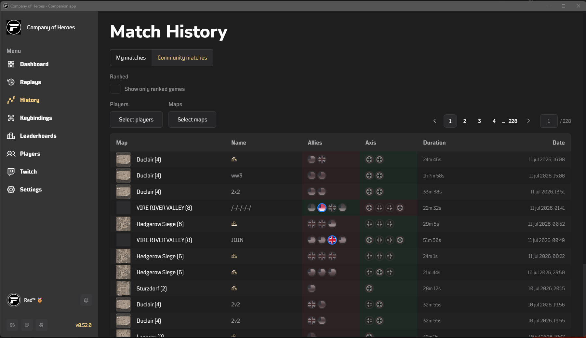
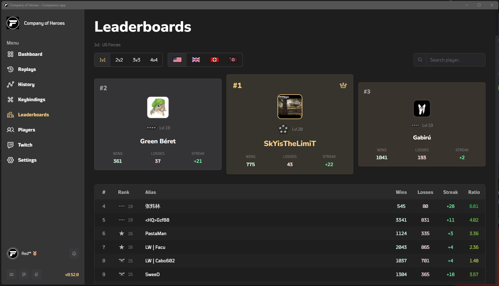
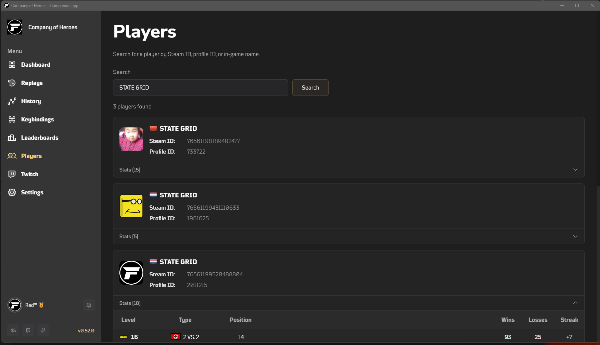

**FkNoobsCoH** is a free desktop companion app for **Company of Heroes**. It runs alongside the game and adds replay analysis, match history, player lookup, leaderboards, custom keybindings, and Twitch streaming tools — all in one place.

Built with **Tauri**, **SvelteKit**, and **PocketBase**.

> [!WARNING]
> **Work in progress:** the app is actively developed. Expect changes, incomplete features, and the occasional bug.

## Features

### Dashboard

Your home screen — recent matches, live lobbies, and quick links into the rest of the app.

### Replays

Scan your local replay folder, browse matches with filters, and open individual replays for details, chat logs, and analysis.

### Match history

Track your games and browse community matches. Open any match for map info, player stats, and outcomes.

### Keybindings

Configure custom shortcuts per faction (USA, Brits, Wehrmacht, Panzer Elite). Record, reorder, export, and import bindings.

### Leaderboards

Browse Relic leaderboards by game mode and faction, with search and podium views.

### Players

Look up players by name, Steam ID, or Relic profile ID. View profiles with match history and stats.

### Twitch

Connect your Twitch account for stream-friendly tooling:

- **TTS** — text-to-speech for chat (ElevenLabs, StreamElements, and more)
- **Bot** — chat bot commands and moderation helpers
- **Overlays** — locally served overlays for OBS (chat, viewer count, OppBot, and others)

### Live game

When a lobby starts, jump into a live view of the current match and save it to your history when the game ends.

### More

- Auto-updates with changelog
- Account sync via PocketBase
- Discord, Twitch, and GitHub links in the sidebar

## Screenshots

### Dashboard



### Replays


### Match history



### Keybindings


### Leaderboards



### Players



### Twitch


---

## Download (latest release)

Use this link to always get the newest version:

- **Latest release:** https://github.com/fknoobs/app/releases/latest

On that page, download the **Windows installer** (the `.exe` that looks like `fknoobscoh_<version>_x64-setup.exe`).

**Do not download** “Source code (zip/tar.gz)” unless you want to build it yourself.

## Install (Windows)

1. Download the `...x64-setup.exe` from the latest release page above
2. Run the installer
3. Follow the setup steps
4. Launch **FkNoobsCoH** from the Start Menu (or the shortcut you choose)

## Security warnings (browser + Windows)

When downloading and installing, you may see warnings like:

- **Your browser**: “This file may not be safe”
- **Windows / SmartScreen**: “Windows protected your PC” / “Unknown publisher”

This is expected right now because the app is **not code-signed** (no signing certificate). Code-signing certificates are **expensive**, and this is a **free hobby project**, so I’m not paying for one at the moment.

If you downloaded the installer from the official GitHub releases page above, you can proceed:

- In Windows SmartScreen: click **More info** → **Run anyway**
- Some browsers may require an extra “Keep” / “Download anyway” confirmation

---

## Development

This is a **pnpm monorepo**. The desktop app lives in `packages/app`; the local PocketBase stack lives in `packages/pocketbase`.

### Prerequisites

- [Node.js](https://nodejs.org/) 20+
- [pnpm](https://pnpm.io/) 9+
- [Rust](https://www.rust-lang.org/tools/install) (for Tauri)
- [Docker](https://www.docker.com/) (for local PocketBase)

### Run locally

From the repo root:

```bash
pnpm install
pnpm dev
```

This starts PocketBase on `http://localhost:8090` and launches the Tauri dev window. PocketBase data is stored in `packages/pocketbase/pb_data`.

### Environment

Copy `packages/app/.env.example` to `packages/app/.env` and set:

```env
PUBLIC_PB_URL=http://localhost:8090
```

When `PUBLIC_PB_URL` is not set, the app falls back to the production API at `https://api.coh1stats.com`.

### PocketBase commands

```bash
pnpm pb:up              # start PocketBase (Docker)
pnpm pb:down            # stop PocketBase
pnpm pocketbase:typegen # regenerate TypeScript types after schema changes
```

Optionally create an admin user at `http://localhost:8090/_/`.

### Build

```bash
pnpm build              # production Tauri build (Windows)
```

Platform-specific builds are also available under `packages/app`:

```bash
pnpm --filter app tauri:build:windows
pnpm --filter app tauri:build:macos
pnpm --filter app tauri:build:linux
```

### Notes

- `packages/pocketbase/pb_data` is gitignored.
- Overlays are developed separately: `pnpm overlays:dev` / `pnpm overlays:build`.

---

### Maintained by

Richard Mauritz — [richard@codeit.ninja](mailto:richard@codeit.ninja)
