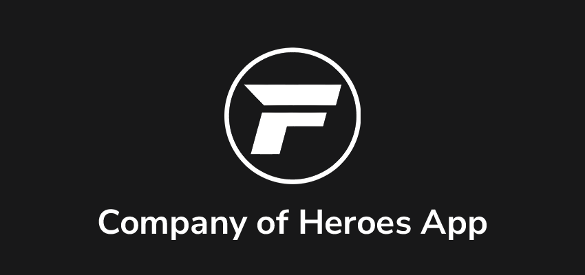
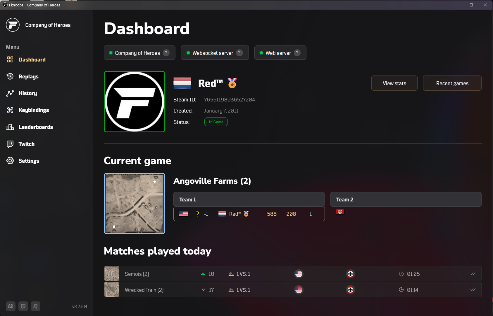

FkNoobsCoH is a **free** companion app for **Company of Heroes** that adds helpful tooling around replays, stats, Twitch, and overlays.

> [!WARNING]
> **Work in progress:** this project is still actively being built. Expect changes, incomplete features, and the occasional bug.

## What the app offers

- **Replay analyzer** — scan and analyze your replays (still working on this part)
- **Replay viewer** — browse and inspect replay details and chat
- **Player / match insights** — surface useful in‑game information
- **Keybindings** — configure custom shortcuts (per faction) and export/import them
- **Twitch integration** — stream-friendly features
- **Twitch overlays** — built-in overlay support (served locally)

## Download (latest release)

Use this link to always get the newest version:

- **Latest release:** https://github.com/fknoobs/app/releases/latest

On that page, download the **Windows installer** (the `.exe` that looks like `fknoobscoh_<version>_x64-setup.exe`).

**Do not download** “Source code (zip/tar.gz)” unless you want to build it yourself.

## Install (Windows)

1. Download the `...x64-setup.exe` from the latest release page above
2. Run the installer
3. Follow the setup steps
4. Launch **FkNoobsCoH** from the Start Menu (or the shortcut you choose)

## Security warnings (browser + Windows)

When downloading and installing, you may see warnings like:

- **Your browser**: “This file may not be safe”
- **Windows / SmartScreen**: “Windows protected your PC” / “Unknown publisher”

This is expected right now because the app is **not code-signed** (no signing certificate).
Code-signing certificates are **expensive**, and this is a **free hobby project**, so I’m not paying for one at the moment.

If you downloaded the installer from the official GitHub releases page above, you can proceed:

- In Windows SmartScreen: click **More info** → **Run anyway**
- Some browsers may require an extra “Keep” / “Download anyway” confirmation

## Screenshot



---

## Development — PocketBase (Docker) ✅

You can run a local PocketBase instance for development using Docker Compose.

1. Start PocketBase:

   ```bash
   pnpm run pb:up
   ```

   This runs a PocketBase container on `http://localhost:8090` and stores data in `./pocketbase`.

   When running

   ```bash
   pnpm run dev
   ```

   Will automatically run `pnpm run pb:up`

2. (Optional) Create an admin user using the admin UI at `http://localhost:8090/_/`.

3. Use the local server in dev by copying `.env.example` to `.env` and setting:

   ```env
   PUBLIC_PB_URL=http://localhost:8090
   ```

4. Generate types (if you need updated types after schema changes):

   ```bash
   pnpm run pocketbase:typegen
   ```

5. Stop PocketBase when done:

   ```bash
   pnpm run pb:down
   ```

Notes:

- The project already ignores the `./pocketbase` data folder in `.gitignore`.
- The PocketBase client now reads `PUBLIC_PB_URL` and falls back to the production URL when not set.

### Maintained

This project is maintained by Richard Mauritz <richard@codeit.ninja>
