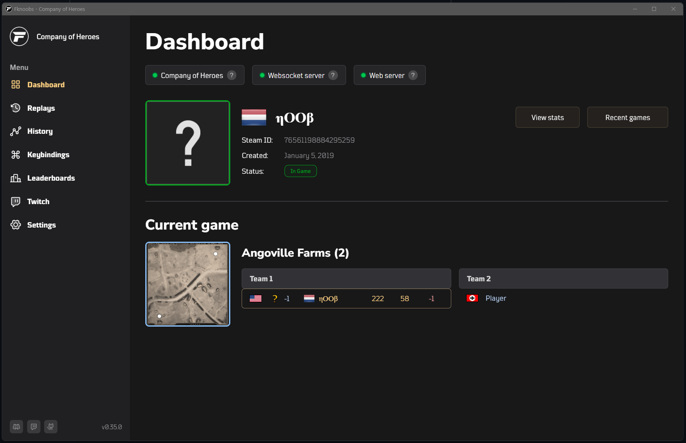

# FkNoobsCoH — Company of Heroes companion app

FkNoobsCoH is a **free** companion app for **Company of Heroes** that adds helpful tooling around replays, stats, Twitch, and overlays.

> **Work in progress:** this project is still actively being built. Expect changes, incomplete features, and the occasional bug.

## What the app offers

- **Replay analyzer** — scan and analyze your replays
- **Replay viewer** — browse and inspect replay details and chat
- **Player / match insights** — surface useful in‑game information
- **Twitch integration** — stream-friendly features
- **Twitch overlays** — built-in overlay support (served locally)

## Download (latest release)

Use this link to always get the newest version:

- **Latest release:** https://github.com/fknoobs/app/releases/latest

On that page, download the **Windows installer** (the `.exe` that looks like `fknoobscoh_<version>_x64-setup.exe`).

**Do not download** “Source code (zip/tar.gz)” unless you want to build it yourself.

## Install (Windows)

1. Download the `...x64-setup.exe` from the latest release page above
2. Run the installer
3. Follow the setup steps
4. Launch **FkNoobsCoH** from the Start Menu (or the shortcut you choose)

## Security warnings (browser + Windows)

When downloading and installing, you may see warnings like:

- **Your browser**: “This file may not be safe”
- **Windows / SmartScreen**: “Windows protected your PC” / “Unknown publisher”

This is expected right now because the app is **not code-signed** (no signing certificate).
Code-signing certificates are **expensive**, and this is a **free hobby project**, so I’m not paying for one at the moment.

If you downloaded the installer from the official GitHub releases page above, you can proceed:

- In Windows SmartScreen: click **More info** → **Run anyway**
- Some browsers may require an extra “Keep” / “Download anyway” confirmation

## Screenshot

